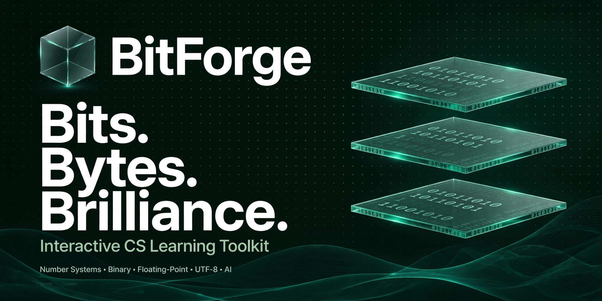
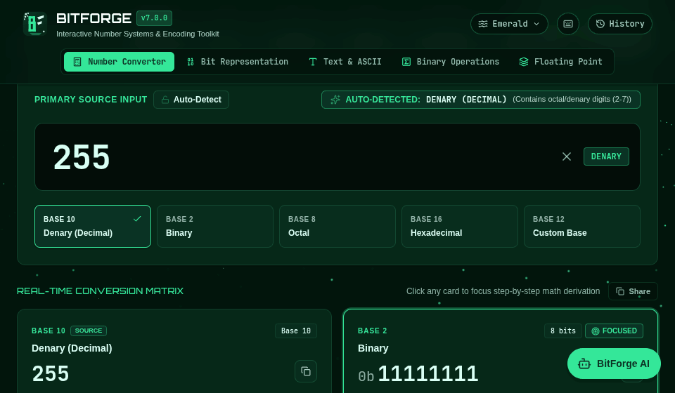
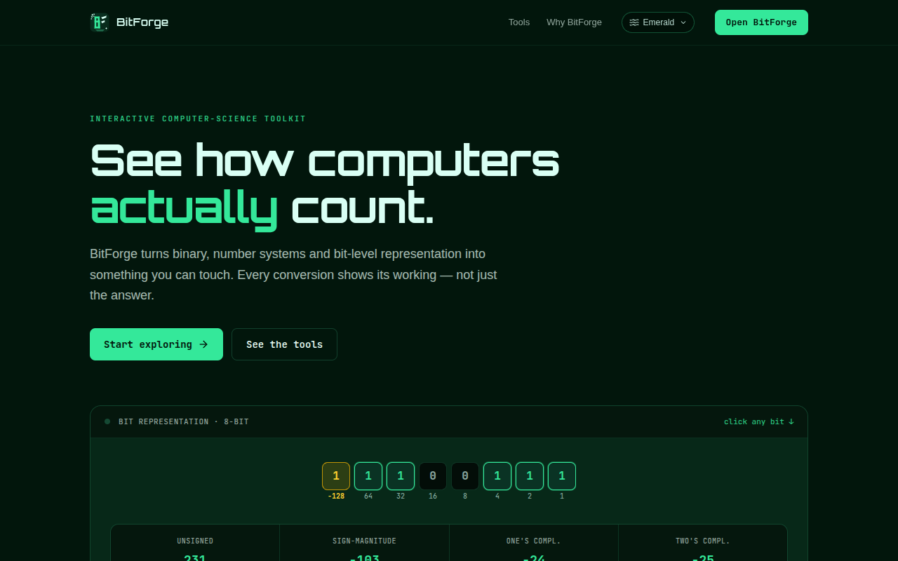
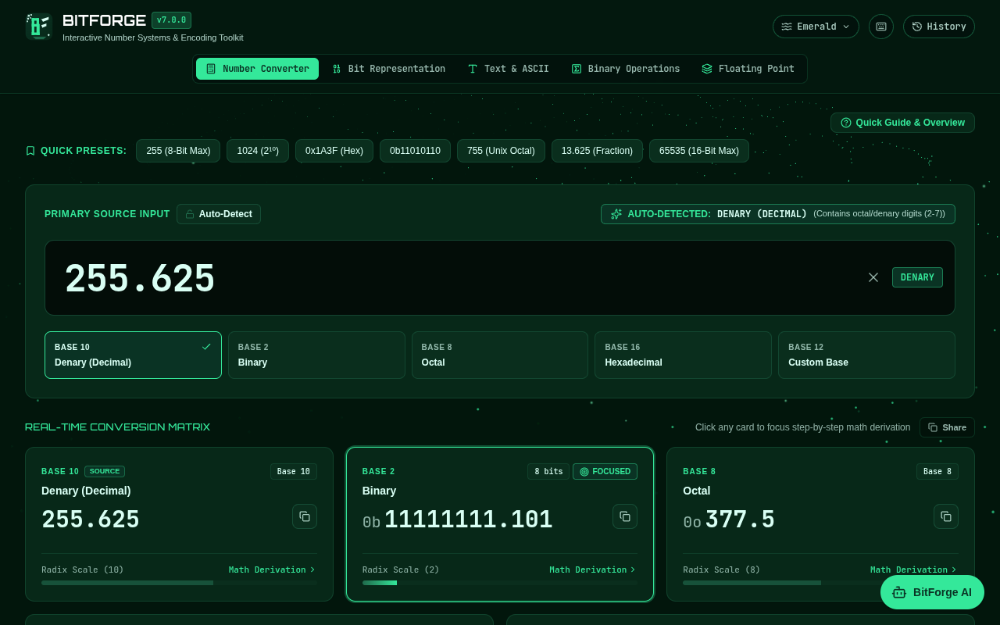
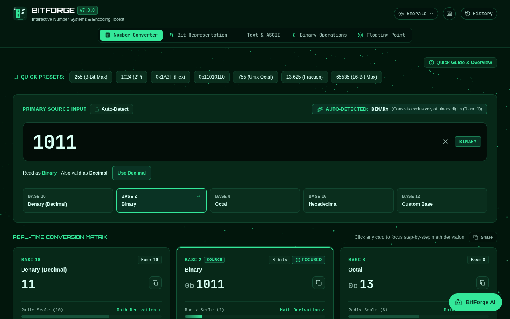
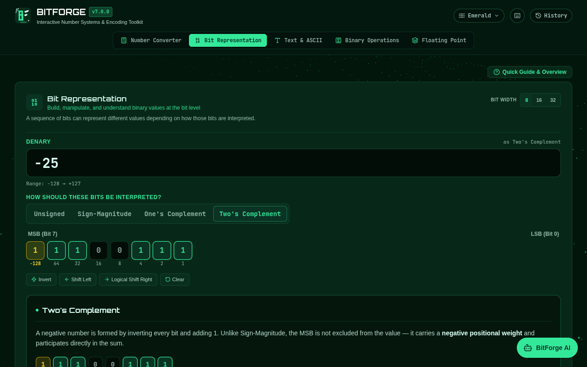
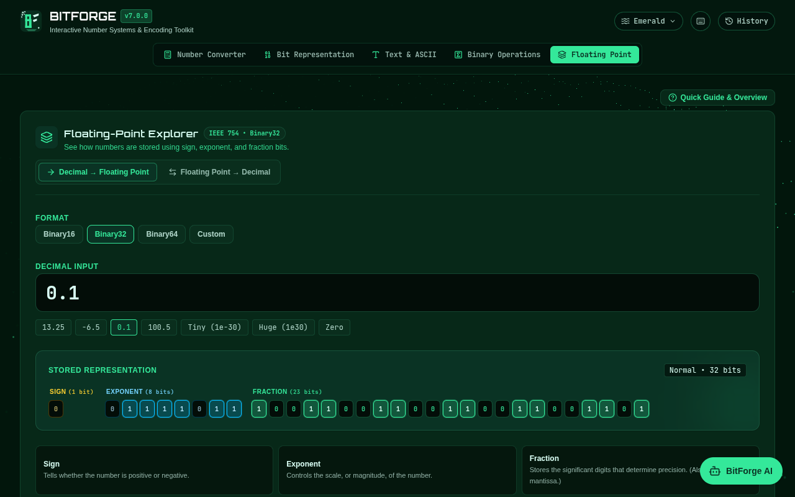

# BitForge

> An interactive toolkit for understanding how computers represent and manipulate numbers — with every result backed by a live, step-by-step derivation.

**[Live Demo](https://bitforge-tool.vercel.app/)** · **[GitHub](https://github.com/shaheeralii/BitForge)** · [Changelog](CHANGELOG.md)

[](https://github.com/shaheeralii/BitForge/actions/workflows/ci.yml)




BitForge puts base conversion, bit-level manipulation, binary arithmetic, signed integer representations, IEEE-754 floating point and UTF-8 encoding into one browser-based tool, for anyone who would rather *see* a conversion happen than read about it. Everything in the five core tools runs client-side in your browser; the only server-side piece is a small Edge Function behind the optional **BitForge AI** assistant.

---

## What BitForge teaches

- **Number systems:** binary, octal, decimal, hexadecimal and any base from 2 to 36, including negative and fractional values. Fractional results are marked as *exact*, *repeating* or *truncated*, so an approximation is never presented as exact.
- **Signed integers:** Unsigned, Sign-Magnitude, One's Complement and Two's Complement on 8, 16 and 32 bits, the same bits read four ways, and how sign extension preserves a value.
- **Bit-level thinking:** toggle individual bits, invert, shift left, logical-shift right, and watch every interpretation update together.
- **Binary arithmetic:** ripple-carry addition, two's-complement subtraction, shift-and-add multiplication and restoring long division at 4 to 64 bits, with carry, borrow and overflow flags.
- **Text encoding:** how characters become real UTF-8 bytes, including accented letters and emoji.
- **Floating point:** how a decimal becomes sign, exponent and fraction bits in Binary16, Binary32, Binary64 or a format you design, including zero, infinity, NaN, subnormals and rounding.

---

## Features

| Mode | What it does |
|---|---|
| 🔢 **Number Converter** | Convert between Decimal, Binary, Octal, Hex, and a custom base (2–36). Auto-detects format from `0x` / `0b` / `0o` prefixes, supports fractional values and negative numbers, and shows every base live alongside a full positional-weight, repeated-division, or bit-grouping derivation. Text made only of 0s and 1s (such as `10`) is read as Binary, and the converter tells you when it is also valid Decimal, with a one-tap switch. Accepts up to 1,024 characters. |
| ➗ **Binary Operations** | Add, subtract, multiply, and divide raw binary values at a chosen bit width (4/8/16/32/64-bit). Every operation shows its full bit-by-bit trace — ripple-carry addition, two's-complement subtraction, shift-and-add multiplication, restoring long division — plus carry, borrow, and overflow flags. Multiplication and division are unsigned, fixed-width operations and are labelled as such. |
| 🧬 **Bit Representation** | One synchronized workspace: type a signed decimal or toggle bits directly on an **8/16/32-bit** grid, then choose how those bits should be interpreted — Unsigned, Sign-Magnitude, One's Complement, or Two's Complement — each with its own explanation and step-by-step derivation. Includes Invert/Shift/Clear, live hex/octal, and "Same Number, Different Encoding" / "Same Bits, Different Meaning" comparisons that show all four systems side by side. |
| 🔤 **Text & UTF-8 Encoding** | Encode text into real UTF-8 bytes — decimal, binary, hex, and octal per byte, plus combined byte streams for the full string — correctly handling accented characters, emoji, and anything outside plain ASCII, with each character flagged as ASCII or not. |
| 🎚️ **Floating-Point Explorer** | See how a decimal number is stored as sign, exponent, and fraction bits, or decode an existing bit pattern back to decimal. Supports the standard Binary16/32/64 formats and a fully configurable Custom Format, with a short plain-language explanation up front and full derivation, rounding, and special-value details available on demand. |

**Also included:** a searchable, persistent Activity History across all five tools; one-click copy and share (Web Share API, with a clipboard fallback) for any result; a keyboard-shortcut reference dialog (`?`); three selectable themes — the original Emerald look, a more restrained Premium Dark Gray, and a lightweight Plain mode with no background animation at all (the default for new visitors with reduced motion enabled at the OS level) — switchable from the header and remembered across visits; screen-reader announcements for converter results and errors; support for `prefers-reduced-motion`; and **BitForge AI**, a lightweight chat assistant that teaches number-system and encoding concepts, backing supported direct conversions and Two's Complement lookups with BitForge's own verified calculation rather than relying entirely on the model's arithmetic.

---

## Visual demonstrations

*Real captures of the running v7.0.0 build, not mock-ups.*

**Landing page**



**Number Converter** — every base live, with a fractional value



**Ambiguous input is called out, not hidden** — `1011` is read as Binary, and is also valid Decimal



**Bit Representation** — the same bits under four interpretations



**Floating-Point Explorer** — 0.1 as Binary32



---

## Tech Stack

| Category | Technology |
|---|---|
| Framework | React 19 |
| Language | TypeScript 5.8 (strict mode) |
| Build Tool | Vite 6 |
| Styling | Tailwind CSS 4 (`@tailwindcss/vite`) |
| Background Rendering | Three.js r143 (custom WebGL shader scene, adaptive quality) |
| Icons | lucide-react |
| Unit / component tests | Vitest, Testing Library, jsdom |
| Browser tests | Playwright (Chromium) |
| Lint | ESLint 9 |
| CI | GitHub Actions |
| Deployment | Vercel |

---

## Project Architecture

```text
BitForge/
├── index.html
├── public/
│   ├── favicon.svg                   # BitForge monogram, also used as the site favicon
│   ├── og-image.png                  # 1200×630 social-preview card
│   ├── robots.txt
│   └── sitemap.xml
├── docs/
│   └── screenshots/                  # README demo GIF + screenshots (real captures of the running app)
├── e2e/
│   └── smoke.spec.ts                 # Playwright browser smoke suite (`npm run test:e2e`)
├── api/
│   └── chat.ts                       # Vercel Edge Function: Gemini proxy + Upstash rate limiting
├── src/
│   ├── main.tsx                      # React entry point; sets device performance tier & theme pre-render
│   ├── AppRoot.tsx                   # Owns the route (single source of truth): landing vs. tool, mode, chat; all navigation goes through it
│   ├── routing.ts                    # Pure hash<->route logic: parseHash, RouteState, URL projection (see routing.test.ts)
│   ├── App.tsx                       # The tool itself (controlled by AppRoot: receives mode/chat as props): layout & overlays
│   ├── index.css                     # Global styles, theme tokens, glass utilities
│   ├── types.ts                      # Shared TypeScript types
│   ├── version.ts                    # Single source of truth for the app version string (stamped into index.html at build time)
│   ├── utils/
│   │   ├── numberParsing.ts          # Canonical numeric-literal parser shared by converter.ts and chatIntent.ts
│   │   ├── converter.ts              # Base conversion, auto-detection (+ 0/1 ambiguity helper), 1,024-character input cap & two's complement
│   │   ├── converterAnnouncement.ts  # Builds the short screen-reader result/error sentences (pure, tested)
│   │   ├── htmlVersion.ts            # Build-time version stamping for index.html (`data-app-version`)
│   │   ├── signedRepresentations.ts  # Unsigned/Sign-Magnitude/One's/Two's Complement encode-decode engine (Bit Representation)
│   │   ├── binaryOps.ts              # Bit-accurate add/sub/mul/div engine + step traces
│   │   ├── floatingPoint.ts          # IEEE 754 breakdown/derivation engine (Binary16/32/64 & custom formats)
│   │   ├── chatIntent.ts             # Routes direct conversion questions through BitForge's own engine before Gemini
│   │   ├── formatAiText.ts           # Markdown/LaTeX-ish parser for BitForge AI responses
│   │   ├── downloadUtils.ts          # History export (CSV / JSON / TXT)
│   │   ├── shareUtils.ts             # Web Share API + clipboard-copy fallback
│   │   └── devicePerf.ts             # Lightweight device-capability heuristic
│   ├── hooks/
│   │   ├── useKeyboardShortcuts.ts   # Global shortcut bindings, input-aware
│   │   ├── useFocusTrap.ts           # Modal focus management (trap, auto-focus, restore)
│   │   ├── useScrollLock.ts          # Locks background scroll while a dialog is open
│   │   ├── useAutoResetTimer.ts      # Timed UI-state resets (e.g. "Copied!" labels)
│   │   └── useDebouncedValue.ts      # Debounces screen-reader announcements so typing doesn't spam them
│   ├── context/
│   │   ├── HistoryContext.tsx        # Activity History provider: React state mirrors the persisted list; cross-tab `storage` sync
│   │   ├── historyStore.ts           # History persistence: validation, versioned wrapper, lock-serialized operations (no lost writes)
│   │   ├── ShortcutTargetContext.tsx # Routes shortcuts to the active tool
│   │   ├── ChatContext.tsx           # BitForge AI conversation state (session-only, not persisted)
│   │   ├── ThemeContext.tsx          # Theme provider: one React state, applied to the DOM by one effect; cross-tab `storage` sync
│   │   └── themeCore.ts              # Theme list, storage validation, applyThemeToDocument (data-theme + browser chrome colors)
│   ├── test/                         # Shared jsdom test helpers and a fake FlowWaveScene
│   ├── three/
│   │   └── FlowWaveScene.ts          # Animated WebGL background (Three.js, tiered quality, per-theme palette)
│   └── components/
│       ├── Header.tsx                # Top nav, mode switcher, logo & theme switcher
│       ├── BitForgeLogo.tsx          # BitForge monogram (SVG, theme-aware)
│       ├── ThemeSwitcher.tsx         # Emerald / Premium / Plain theme picker
│       ├── FlowWaveBackground.tsx    # Static base layer + FlowWave canvas (canvas and scene exist only under Emerald/Premium)
│       ├── LandingPage.tsx           # Marketing landing page (route: '#/' — see AppRoot.tsx)
│       ├── WelcomeBanner.tsx         # First-time user onboarding guide (in-app, not the landing page)
│       ├── InfoDialog.tsx            # About / Help / Privacy / Terms / Disclaimer tabs
│       ├── HistoryPanel.tsx          # Activity History slide-over panel
│       ├── ShortcutsHelpDialog.tsx   # Keyboard shortcut reference dialog
│       ├── ShareButton.tsx           # Shared copy/share control used across every tool
│       ├── PresetsBar.tsx            # Quick-select preset values
│       ├── ConversionInput.tsx       # Base input, auto-detect panel, 0/1 ambiguity notice & input-length notice
│       ├── ConverterAnnouncer.tsx    # Two small visually-hidden live regions (status / alert) for converter results
│       ├── LiveBasesGrid.tsx         # All-bases live output grid
│       ├── StepByStepBreakdown.tsx   # Conversion derivation steps
│       ├── DerivationDisclosure.tsx  # Shared closed-by-default toggle for derivation panels
│       ├── BinaryOperationsCard.tsx  # Binary arithmetic UI + derivation tables
│       ├── BitCellRow.tsx            # Shared interactive/static bit-row visualization primitive
│       ├── BitRepresentationLab.tsx  # Bit Representation: unified denary+bit-grid workspace (merges the former Bit Grid & Two's Complement pages)
│       ├── BitRepresentationPanel.tsx    # Per-representation explanation + derivation panel
│       ├── BitRepresentationInsights.tsx # Collapsible reference panels (same bits/different meaning, why two's complement, comparison table)
│       ├── AsciiConverterCard.tsx    # Text ↔ UTF-8/binary/hex/octal encoder
│       ├── FloatingPointCard.tsx     # Floating-Point Explorer (IEEE 754 & custom formats)
│       ├── FloatBitStrip.tsx         # Interactive sign/exponent/fraction bit strip
│       ├── ChatAssistant.tsx         # BitForge AI chat panel & launcher
│       ├── FormattedAiMessage.tsx    # Renders parsed BitForge AI responses
│       └── Footer.tsx                # Status footer bar
├── CHANGELOG.md                      # Full release history (moved out of the README)
├── package.json
├── vite.config.ts                    # Also stamps APP_VERSION into index.html
├── vitest.config.ts
├── playwright.config.ts              # Browser smoke-suite configuration
├── eslint.config.js
├── .github/
│   └── workflows/
│       └── ci.yml                    # install, typecheck, test, build (blocking); lint (informational)
└── tsconfig.json
```

---

## Getting Started

**Prerequisites:** [Node.js](https://nodejs.org/) 22.22.2 or newer on the 22 line (recommended — this is what CI uses), or 24.15+ on the 24 line, or 26+; and npm. Odd-numbered releases (23, 25) fall outside the test runner's declared range.

The requirement comes from the dependencies' declared `engines` fields, not from a guess:

| What you run | Needs | Because |
|---|---|---|
| `npm run dev` / `npm run build` | Node 20.19+ or 22.12+ | `@vitejs/plugin-react` 5 (`^20.19.0 \|\| >=22.12.0`) |
| `npm test` | Node **22.22.2+**, 24.15+ or 26+ | `jsdom` 30 (`^22.22.2 \|\| ^24.15.0 \|\| >=26.0.0`) |
| `npm run test:e2e` | Node 20+ | `@playwright/test` |

CI runs on Node 22. Node 18 is **not** supported. These ranges are read from the dependencies' metadata; the suite was run here on Node 22.22.2.

```bash
git clone https://github.com/shaheeralii/BitForge.git
cd BitForge
npm ci
npm run dev        # http://localhost:3000
```

```bash
npm run build       # outputs to dist/
npm run preview      # preview the production build
```

### Development

```bash
npm run typecheck   # tsc --noEmit — the fast, authoritative correctness gate
npm run lint         # eslint . — catches real mistakes (stale hook deps, unused vars),
                      # not a style guide; kept deliberately separate from typecheck
npm test             # vitest run — unit and component tests
npm run test:e2e     # playwright test — browser smoke suite (see Testing)
```

`npm run typecheck` and `npm run lint` check different things and are not
interchangeable: TypeScript's structural type-checking doesn't catch a stale
closure over a `useEffect` dependency, and ESLint doesn't catch a type
mismatch. Typecheck, unit tests and a production build run in CI
(`.github/workflows/ci.yml`) on every push and pull request. Lint runs there as
informational rather than a blocking gate — see the comment in that workflow
file. The browser suite is run locally and is not part of CI.

`tsconfig.json` does not enable `noUnusedLocals`/`noUnusedParameters`;
ESLint's `@typescript-eslint/no-unused-vars` is what catches those instead,
so an unused import or variable shows up in `npm run lint`, not
`npm run typecheck`.

### BitForge AI setup (optional)

The five core tools work with zero configuration. To also run **BitForge AI** locally or in your
own Vercel deployment, copy `.env.example` to `.env.local` and fill in:

| Variable | Where to get it |
|---|---|
| `GEMINI_API_KEY` | A free key from [Google AI Studio](https://aistudio.google.com/apikey) |
| `GEMINI_MODEL` *(optional)* | Overrides the Gemini model used by `/api/chat`. Defaults to a current stable GA model — see `.env.example` before assuming the default hasn't been deprecated ([deprecation schedule](https://ai.google.dev/gemini-api/docs/deprecations)) |
| `UPSTASH_REDIS_REST_URL` / `UPSTASH_REDIS_REST_TOKEN` | A free Redis database at [Upstash](https://console.upstash.com/redis) (used only for rate limiting; if omitted, the endpoint runs without rate limiting, but if set and later unreachable, `/api/chat` fails closed rather than letting requests through unmetered) |

On Vercel, set the same variables under **Project Settings → Environment Variables** — the
`/api/chat` Edge Function picks them up automatically, and the API key never reaches the browser.

---

## Testing

- **Unit and component tests** (`npm test`): the math engines (conversion, signed representations, binary operations, IEEE-754), parsing, routing, history, theming and the UI components. Where possible, results are checked against an independent reference rather than the algorithm under test: IEEE-754 encodings against the platform `DataView`, subtraction flags against a `BigInt` reference (all 256 operand pairs at 4 bits, plus boundary grids up to 64 bits), and the linear-time parsers against the regular expressions they replaced (exhaustively over short strings).
- **Browser smoke suite** (`npm run test:e2e`): drives the production build in a real Chromium — direct route loads, refresh, Back/Forward, all six theme transitions without a reload, the real clipboard, the 1,024-character boundary, the ambiguity notice (including `.1`) and incomplete-input hints, bit toggling, floating-point special values, keyboard behaviour and focus trapping, header and tab-bar geometry from 320 px up to 1920 px, and horizontal-overflow checks at each width. Every test also fails on any console error or failed network request.

```bash
npx playwright install chromium   # once
npm run test:e2e                  # builds, serves the production build, runs the suite
# Offline or restricted network: point the suite at a Chromium you already have
BITFORGE_CHROMIUM_PATH=/path/to/chrome npm run test:e2e
BITFORGE_E2E_URL=https://your-deployment.example npm run test:e2e   # or target a deployment
```

Automated browser tests run in Chromium only; other browsers have not been covered by automated tests.

---

## Contributing

Issues and pull requests are welcome. Before opening a pull request, please run `npm run typecheck`, `npm test` and `npm run build`, and `npm run test:e2e` if you touched anything user-facing. For changes to a math engine, include a test that checks the result against an independent reference rather than against the same algorithm. BitForge is deliberately a focused learning tool: proposals that add accounts, tracking or unrelated features are out of scope.

---

## Known limitations

- **Converter input length:** the Number Converter accepts at most **1,024 characters** and trims longer text with a notice. The full derivation grows roughly quadratically with digit count, so far larger inputs would freeze a tab; the limit keeps the worst case interactive.
- **Bare 0/1 text is read as Binary:** `10` is read as two, not ten, and `.1` is read as 0.5, not 0.1. The converter says when an input is also valid Decimal but reads as a different number, and offers a one-tap switch, and a prefix (`0b`, `0x`, `0o`) or a locked base removes the ambiguity.
- **Zero has no sign in the Number Converter:** `-0` and `-000` are simply `0`, and `-0.0` is `0.0`. Negative zero is shown where it exists: IEEE-754 (Floating-Point Explorer) and the Sign-Magnitude / One's Complement patterns (Bit Representation).
- **Binary Operations semantics:** multiplication and division are unsigned, fixed-width operations on the chosen width. Addition and subtraction report both unsigned and signed overflow. The final-carry indicator on subtraction follows the displayed `A + two's complement of B` trace.
- **Incomplete numbers are not results:** while you are mid-entry (`-`, `.`, `0.`, a bare `0x`) the converter shows a "Waiting for digits" hint rather than an error or a value. `0.` is not treated as a finished zero.
- **Bit Representation widths:** 8, 16 and 32 bits only.
- **Floating-point precision model:** decimal input is first represented using JavaScript's IEEE-754 binary64 number type before conversion to the selected target format. Extremely precise decimal values near a target-format rounding boundary may therefore reflect the intermediate binary64 rounding. BitForge does not claim arbitrary-precision decimal-to-IEEE conversion. The encodings the engine produces are checked in the unit tests against the platform's own `DataView` for a range of values, special values and rounding cases, but that is not a proof of correct rounding for every possible decimal string.
- **Bundle size:** in the v7.0.0 build the main JavaScript bundle is roughly 850 kB (about 234 kB gzipped), and Three.js accounts for about half of it (measured from a source map) for the optional animated background. The Plain theme never starts the scene, but its code is still downloaded.
- **BitForge AI is optional** and needs server-side configuration (see *BitForge AI setup*). Without it, the assistant reports itself as unavailable and nothing else is affected.
- **Browsers:** automated tests cover Chromium only.

---

## Release history

The complete, detailed release history — from v1.0.0 to the current release — lives in **[CHANGELOG.md](CHANGELOG.md)**.

| Version | Highlights |
|---|---|
| **v7.0.0** | Public-release hardening: input cap and parser hardening, Binary/Decimal ambiguity notice (including `.1`), incomplete-input hints, integer negative-zero normalisation, corrected subtraction flags, header/tab-bar fixes, accessibility and reduced-motion work, expanded browser tests |
| **v6.1.0** | UI synchronization, route ownership, lossless multi-tab history; public-release hardening pass on top (input limit, subtraction flags, accessibility, responsive fixes) |
| v6.0.0 | Bit Representation redesign, landing page, legal and compliance pages |
| v5.1.0 | Selectable themes, mobile popup fixes, BitForge AI rendering |
| v5.0.0 | User-readiness, trust, AI learning assistant, polish pass |
| v4.0.0 | Correctness audit, accessibility pass, adaptive performance |
| v3.0.0 | Performance overhaul and conversion history |
| v2.0.0 | Premium Emerald UI and Binary Operations |
| v1.0.0 | Initial release |

---

## License

[MIT](LICENSE)

   ## Author

   **Syed Shaheer Ali** · BS Computer Science, Bahria University Karachi

   [GitHub](https://github.com/shaheeralii) · [LinkedIn](https://www.linkedin.com/in/syedshaheer/)
